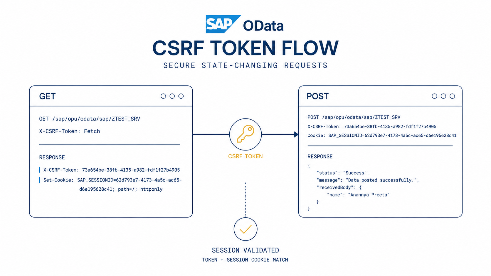
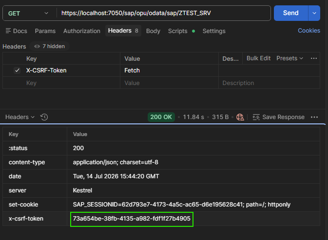
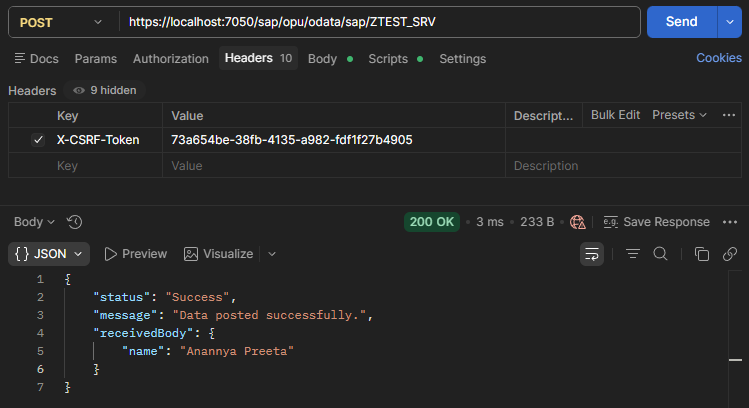

If you've worked with **SAP OData Services**, you've probably encountered this scenario:

- Authentication succeeds ✅
- Your endpoint is correct ✅
- The payload looks valid ✅

Yet every **POST** request returns:

```text
403 Forbidden
```

The reason is usually not authentication.

It's **CSRF Token Validation**.

In this article, we'll explore what CSRF tokens are, why SAP uses them, and the request flow required to successfully perform state-changing operations.

---

# What is a CSRF Token?

**CSRF** stands for **Cross-Site Request Forgery**.

It's a security mechanism that protects web applications from unauthorized requests made on behalf of an authenticated user.

Whenever a request modifies data, SAP Gateway requires proof that the request actually originated from the authenticated client.

Instead of relying solely on authentication, SAP issues a unique token that must accompany every request that changes data.

This applies to:

- POST
- PUT
- PATCH
- DELETE

---

# How SAP's CSRF Flow Works

The process consists of two requests.

<Mermaid chart={`
flowchart TD
    A["GET request<br/>X-CSRF-Token: Fetch"] --> B["SAP Gateway"]
    B --> C["200 OK<br/>X-CSRF-Token + Set-Cookie"]
    C --> D["POST request<br/>token + session cookie"]
    D --> B
`} />

---

# Step 1 — Request the CSRF Token

Before sending a POST request, send a GET request with the following header.

```http
GET /sap/opu/odata/sap/ZTEST_SRV

X-CSRF-Token: Fetch
```

The value **Fetch** tells SAP Gateway to generate and return a CSRF token.

If the request succeeds, SAP returns:

- `X-CSRF-Token`
- `Set-Cookie`

The screenshot below shows the response in Postman.



Notice the highlighted response header.

```text
X-CSRF-Token:
73a654be-38fb-4135-a982-fdff1f27b4905
```

SAP also issues a session cookie.

```text
Set-Cookie:
SAP_SESSIONID=...
```

Both values belong to the same authenticated session.

---

# Why Is the Session Cookie Important?

A common misconception is that the CSRF token alone is enough.

It isn't.

SAP validates:

- the session cookie
- the CSRF token issued for that session

This prevents a valid token from being reused in another session.

If either value is missing or invalid, SAP rejects the request.

---

# Step 2 — Send the POST Request

Once the token has been retrieved, include it in your POST request.

```http
POST /sap/opu/odata/sap/ZTEST_SRV

Content-Type: application/json
X-CSRF-Token: 73a654be-38fb-4135-a982-fdff1f27b4905
```

Example request body:

```json
{
    "name": "Anannya Preeta"
}
```

The completed request looks like this.



Because the request contains both the CSRF token and the session cookie, SAP validates the request and processes it successfully.

---

# Understanding the Lifecycle

You can think of the process as a short-lived security pass.

<Mermaid chart={`
flowchart TD
    A[Authenticate] --> B[Fetch CSRF token]
    B --> C["Receive token +<br/>session cookie"]
    C --> D["POST / PUT / PATCH / DELETE<br/>with token + cookie"]
    D --> E{"Token + session<br/>match?"}
    E -->|Yes| F[200 OK]
    E -->|No| G[403 Forbidden]
`} />

---


# Putting It All Together

The complete request flow looks like this:

1. Authenticate with SAP.
2. Send a GET request with `X-CSRF-Token: Fetch`.
3. Receive both the CSRF token and the session cookie.
4. Send the POST request with:
   - the CSRF token
   - the same session cookie
5. SAP validates both before processing the request.

This two-step handshake is what prevents unauthorized state-changing requests while ensuring the request originates from the same authenticated session.

---

# Using .NET to Fetch a CSRF Token

Fetching the token in .NET is straightforward using `HttpClient`.

```csharp
using var request = new HttpRequestMessage(HttpMethod.Get, serviceUrl);

request.Headers.Add("X-CSRF-Token", "Fetch");

var response = await client.SendAsync(request);

var csrfToken = response.Headers
    .GetValues("X-CSRF-Token")
    .FirstOrDefault();
```

Once retrieved, include the token in subsequent requests.

```csharp
var request = new HttpRequestMessage(HttpMethod.Post, serviceUrl);

request.Headers.Add("X-CSRF-Token", csrfToken);

request.Content = new StringContent(
    JsonSerializer.Serialize(payload),
    Encoding.UTF8,
    "application/json");

await client.SendAsync(request);
```

If you're using the same `HttpClient` with a `CookieContainer`, the session cookie is preserved automatically.

---

# Common Causes of 403 Forbidden

If a POST request fails, check the following:

- The `X-CSRF-Token` header is missing.
- The session cookie isn't being sent.
- The token belongs to another session.
- The token has expired.
- A new authentication session invalidated the previous token.

In most cases, fetching a fresh CSRF token resolves the issue.

---

# Best Practices

When integrating with SAP OData services:

- Always fetch a CSRF token before state-changing requests.
- Preserve session cookies throughout the session.
- Handle expired tokens gracefully.
- Log request and response headers during development.
- Refresh the token after re-authentication.

---

# Final Thoughts

CSRF token validation is a fundamental part of SAP OData's security model.

Although it introduces an additional step before modifying data, the overall process is straightforward:

1. Authenticate.
2. Fetch the CSRF token.
3. Store the session cookie.
4. Include both in every POST, PUT, PATCH, or DELETE request.

Understanding this lifecycle not only helps prevent `403 Forbidden` errors but also makes troubleshooting SAP OData integrations significantly easier.

I hope this walkthrough helps clarify how SAP Gateway validates state-changing requests and serves as a useful reference the next time you're working with SAP OData services.


Happy coding! 